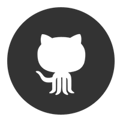

<h1 align="center">Welcome to pyCommit</h1>
</a>
<p>
    <a href="https://www.npmjs.com/package/readme-md-generator">
    

  </a> 
  
  
  <a href="#" target="_blank">
    
  </a>
   <a href="https://github.com/imthaghost/gitmoji-changelog">
    
  </a>
  
</p>

> Go away on a trip or simply just a noob but your commit wall is life? Try out pyCommit it does absolutely nothing except provides the user a console to specify what days the daemon process should create commits for you. This will allow you to have a green wall year round!

### 💻 Prerequisites

What things you need to run the software

```bash
- Python 3.4+
- Pipenv
- Brew
```

## 🚀 Getting Started

### macOS Mojave 10.0+, Catalina 10.1+

```bash
# clone the repo
git clone https://github.com/imthaghost/pycommit
```

## :white_check_mark: Todo

-   [x] Allow users to create a number of commits for the day
-   [ ] Run program as a dameon on computer
-   [ ] Create web application to allow users to not have to run code locally

## :hammer: Built With

-   [pyGithub](https://github.com/PyGithub/PyGithub/) - Github Python API

## 🤝 Contribution Guidlines

### Use [Github Flow](https://guides.github.com/introduction/flow/index.html), So All Code Changes Happen Through Pull Requests

Pull requests are the best way to propose changes to the codebase (we use [Github Flow](https://guides.github.com/introduction/flow/index.html)). We actively welcome your pull requests:

1. Fork the repo and create your branch from `master`.
2. If you've added code that should be tested, add tests.
3. If you've changed APIs, update the documentation.
4. Ensure the test suite passes.
5. Make sure your code lints.
6. Issue that pull request!

### Any contributions you make will be under the MIT Software License

In short, when you submit code changes, your submissions are understood to be under the same [MIT License](http://choosealicense.com/licenses/mit/) that covers the project. Feel free to contact the maintainers if that's a concern.

### Report bugs using Github's [issues](https://github.com/briandk/transcriptase-atom/issues)

Use GitHub issues to track public bugs. Report a bug by [opening a new issue](); it's that easy!

### Use a Consistent Coding Style

-   PEP 8 style unification
-   2 spaces for indentation rather than tabs (or tabs that convert to spaces)
-   You can try running `pipenv install autopep8 --dev` for style unification

## 📝 License

By contributing, you agree that your contributions will be licensed under its MIT License.

## Contributors

<table>
  <tr>
    <td align="center"><a href="https://github.com/imthaghost"><br /><sub><b>Gary Frederick</b></sub></a><br /><a href="https://github.com/imthaghost/ghostChat/commits/master" title="Code">💻</a></td>
    </tr>
</table>